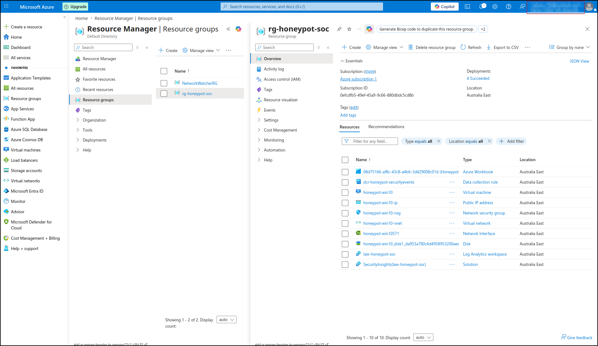
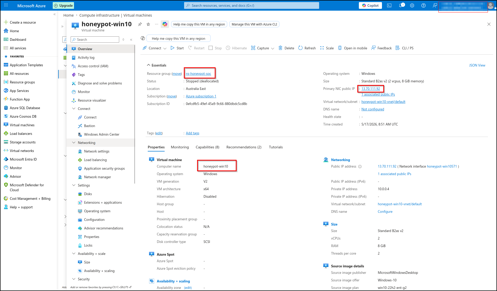

# Architecture

## Resource Group Overview

All lab resources are deployed within a single Azure Resource Group (`rg-honeypot-soc`) located in the Australia East region. This single-RG design enables one-click teardown at the end of the experiment.

## Virtual Machine Configuration

The honeypot VM (`honeypot-win10`) is a Standard_B2s instance running Windows 10 Pro 22H2. RDP (TCP/3389) is deliberately exposed to the internet (0.0.0.0/0) via an NSG rule named `RDP-Internet-Honeypot`.

## Architecture Overview

This lab implements an all-Azure SOC architecture using Microsoft's native security stack.

## Components

| Component | Resource Name | Purpose |
|---|---|---|
| Resource Group | `rg-honeypot-soc` | Container for all lab resources (Australia East) |
| Honeypot VM | `honeypot-win10` | Windows 10 Pro 22H2, Standard_B2s — the bait |
| Virtual Network | `honeypot-win10-vnet` | Isolated VNet for the VM |
| Network Security Group | NSG with RDP/3389 open to `0.0.0.0/0` | Allows attacker traffic to reach the VM |
| Public IP | Static IPv4 | Internet-routable address for the VM |
| Log Analytics Workspace | `law-honeypot-soc` | Stores all log data (30-day retention) |
| Microsoft Sentinel | Enabled on `law-honeypot-soc` | SIEM layer providing analytics, workbooks, incidents |
| Data Collection Rule | `dcr-honeypot-securityevents` | Routes Windows Security events from VM → workspace |
| Azure Monitor Agent | Installed on VM via DCR | The agent that ships logs |

## Data Flow

[Internet attackers]
↓ RDP/3389 brute force
[honeypot-win10 VM (Windows 10 Pro)]
↓ Generates Windows Security Event logs
↓ (Event IDs 4624, 4625, 4634, 4672, etc.)
[Azure Monitor Agent (AMA)]
↓ Forwards events as per DCR configuration
[Data Collection Rule: dcr-honeypot-securityevents]
↓ Routes to destination workspace
[law-honeypot-soc Log Analytics Workspace] → SecurityEvent table
↓ Queried by KQL
[Microsoft Sentinel Layer]
├─→ Scheduled Query Analytics Rules → Incidents queue
└─→ Custom Workbook → Attack map + summary tiles

## Key Design Decisions

### 1. AMA over MMA (Microsoft Monitoring Agent)
The legacy Microsoft Monitoring Agent is deprecated as of August 2024. Azure Monitor Agent is the current standard and is required for new deployments.

### 2. Sentinel connector-based DCR (CRITICAL)
The Data Collection Rule was created via the **"Windows Security Events via AMA" connector page in Sentinel**, *not* via Azure Monitor → Data Collection Rules.

**Why this matters:** Only the connector-created DCR populates the `SecurityEvent` table, which Sentinel's analytics rules and workbooks expect. A generic DCR populates the `Event` table, which does not trigger Sentinel detections.

This is poorly surfaced in Microsoft's documentation. Many learners (myself included initially) struggle here for hours.

### 3. Single-region deployment (Australia East)
VM, workspace, and DCR all in Australia East. Cross-region DCR-to-workspace configurations sometimes cause silent log-collection failures and add latency.

### 4. Single resource group
All resources in `rg-honeypot-soc`. Enables one-click teardown via "Delete resource group" — kills the VM, NSG, VNet, public IP, workspace, Sentinel, and DCR in a single operation.

### 5. NSG, not Azure Firewall
For this lab, a Network Security Group provides sufficient L3/L4 filtering. Azure Firewall would add ~AUD $35/day in standing charges with no additional capability needed for this experiment.

### 6. RDP exposed deliberately to 0.0.0.0/0
The NSG rule `RDP-Internet-Honeypot` allows TCP/3389 from any source IP. **This is intentional and not a production pattern.** Production systems should use Azure Bastion, VPN-fronted RDP, or just-in-time (JIT) VM access via Defender for Cloud.

## Detection Pipeline Timeline

The journey from attack to incident takes approximately 5-15 minutes:

| Time | Event |
|---|---|
| T+0 | Attacker IP attempts RDP login → fails |
| T+0 | Windows logs Event ID 4625 (failed logon) to Security event log |
| T+1-2 min | Azure Monitor Agent reads the log |
| T+2-3 min | Agent ships event per DCR rules to `law-honeypot-soc` |
| T+3-5 min | Event arrives in `SecurityEvent` table, queryable via KQL |
| T+5-10 min | Next scheduled run of analytics rule evaluates the data |
| T+5-15 min | If thresholds met, incident appears in Sentinel Incidents queue |
| T+5-15 min | SOC analyst receives the alert |

## Cost Profile

For a 72-hour exposure window:

| Component | Cost |
|---|---|
| VM compute (B2s, ~AUD $0.10/hr) | ~AUD $7 |
| Storage (Standard HDD, ~AUD $0.03/day) | ~AUD $0.10 |
| Public IP | ~AUD $0.40 |
| Log Analytics ingestion (free tier covered usage) | $0 |
| Sentinel (free first 31 days, then per-GB) | $0 |
| NSG, VNet | $0 |
| **Total estimated cost** | **~AUD $7-8** |

## Teardown

Lab teardown is intentionally simple: delete the resource group. This cascades the deletion to every resource within, leaving no orphaned components.

Azure Portal → Resource groups → rg-honeypot-soc → Delete resource group

Verify zero ongoing spend the following day via Cost Management + Billing.

