# Honeypot Attack Analysis Report

**Author:** Nishan Rajmulik  
**Project Duration:** May 16–19, 2026  
**Exposure Window:** ~72 hours  
**Region:** Australia East  
**Status:** Completed

---

## Executive Summary

A Windows 10 virtual machine was deliberately exposed to the public internet on Microsoft Azure for approximately 72 hours to study real-world attacker behaviour. During the observation period, the honeypot recorded **297,534 failed authentication attempts** from **28 unique source IP addresses** across **14 countries**. Custom detection rules built in Microsoft Sentinel generated **39 incidents** correctly identifying password spray, RDP brute force, and distributed brute force patterns. **No successful unauthorised logons occurred**, validating that strong credential hygiene effectively prevented compromise despite massive attack volume.

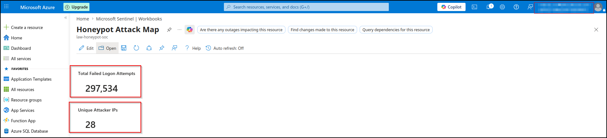

## 1. Lab Architecture

A single resource group (`rg-honeypot-soc`) hosted all components, enabling one-click teardown at project end. For detailed architecture documentation, see [`architecture/README.md`](../architecture/README.md).

Key components:

- **Honeypot VM:** Windows 10 Pro 22H2, Standard_B2s, RDP exposed on TCP/3389 to the internet (0.0.0.0/0)
- **Log Analytics Workspace:** `law-honeypot-soc` (30-day retention)
- **SIEM:** Microsoft Sentinel enabled on the workspace
- **Agent:** Azure Monitor Agent (AMA) installed via DCR, configured via the "Windows Security Events via AMA" connector
- **Detection:** 5 custom Scheduled Query Analytics Rules, mapped to MITRE ATT&CK
- **Visualisation:** Custom Sentinel Workbook with attack map, top usernames, and time-series analysis

## 2. Methodology

### Phase 1: Foundation
Created the resource group, Log Analytics Workspace, enabled Sentinel, installed the Windows Security Events solution from Content Hub.

### Phase 2: VM Build
Deployed Windows 10 VM with non-standard admin username (`labadmin`), strong password, RDP allowed only from local IP initially. Verified RDP access, disabled Windows Firewall to ensure full logging fidelity.

### Phase 3: Log Pipeline
Critical learning: created the Data Collection Rule via the **Sentinel connector page**, not via Monitor → DCRs. The connector-created DCR populates the `SecurityEvent` table (which Sentinel detections expect); the generic DCR populates the `Event` table (which does not trigger built-in detections). This is poorly documented and a common pitfall.

### Phase 4: Exposure
Reconfigured NSG to allow RDP/3389 from 0.0.0.0/0. First attack arrived in **~20 hours**, slower than typical (most studies report <1 hour) — likely due to Australia East being a less common scan target than US/EU regions.

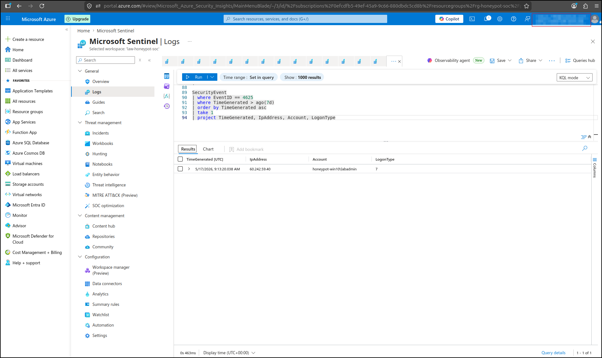

### Phase 5: Detection Rules
Built 5 KQL analytics rules covering: single-IP brute force, brute-force success, geographic anomaly, password spray, and distributed brute force. All rules mapped to MITRE ATT&CK and tagged with appropriate tactics/techniques.

### Phase 6: Analysis & Teardown
Ran final analysis queries, captured workbook screenshots, exported rule definitions, stopped and deleted the VM. Retained logs in the workspace for 30-day post-analysis access.

## 3. Findings

### 3.1 Attack Volume

In ~72 hours of exposure, the honeypot logged **297,534 failed authentication events** (Event ID 4625).

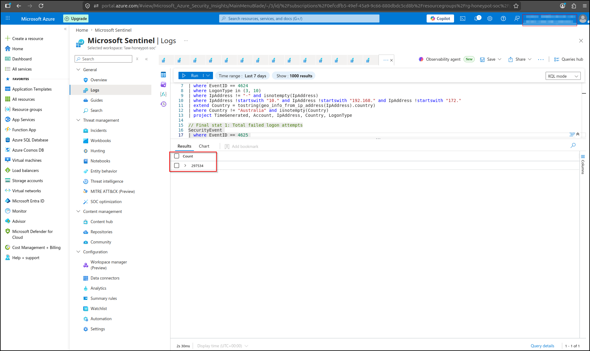

Peak attack volume reached approximately **60,000 attempts per hour** during a single coordinated burst around 22:00 AEST on day 1.

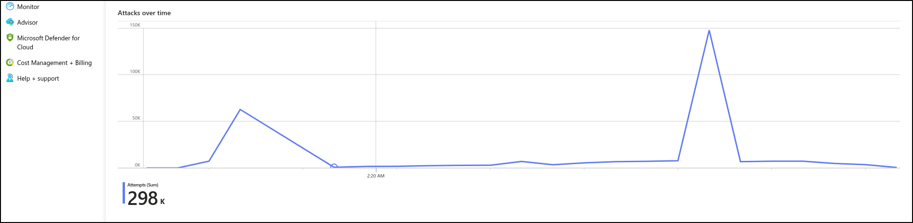

### 3.2 Geographic Distribution

Attacks originated from 14 countries.

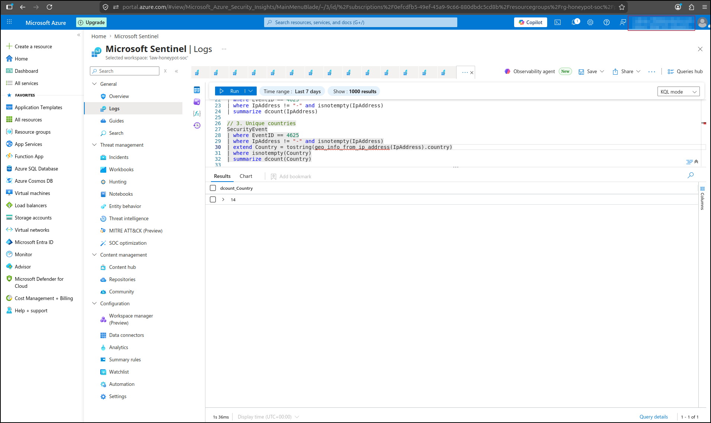

Top sources by volume:

| Rank | Country | Attempts | % of total |
|---|---|---|---|
| 1 | United States | 99,076 | 33.3% |
| 2 | Ukraine | 69,910 | 23.5% |
| 3 | Bangladesh | 30,699 | 10.3% |
| 4 | Romania | 27,677 | 9.3% |
| 5 | Malaysia | 14,838 | 5.0% |

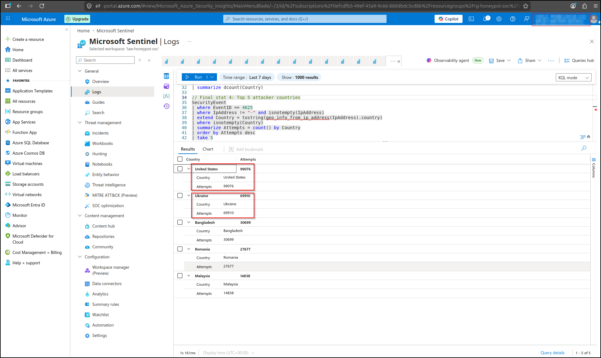

Notably, the US, Ukraine, and Bangladesh together account for 67% of all observed traffic.

### 3.3 Attacker IP Concentration

A total of 28 unique source IPs were observed.

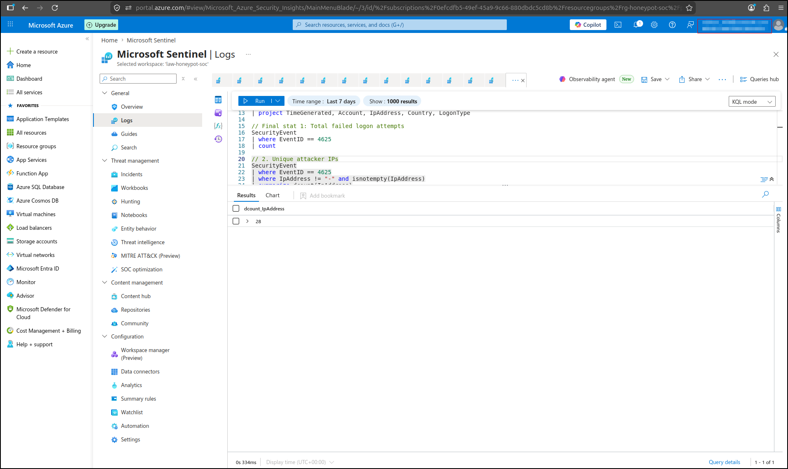

A single US-based IP, **20.119.34.7**, generated 99,068 attempts — **33% of all observed attack traffic**. This suggests dedicated attacker infrastructure rather than opportunistic botnet activity. The next four IPs each represent 5-10% of traffic, indicating a "long tail" of moderately-persistent attackers behind one highly-persistent actor.

| Rank | IP | Country | Attempts |
|---|---|---|---|
| 1 | 20.119.34.7 | United States | 99,068 |
| 2 | 119.148.8.66 | Bangladesh | 30,699 |
| 3 | 80.94.95.83 | Romania | 27,671 |
| 4 | 165.99.199.134 | Malaysia | 14,838 |
| 5 | 138.94.140.190 | Mexico | 14,401 |

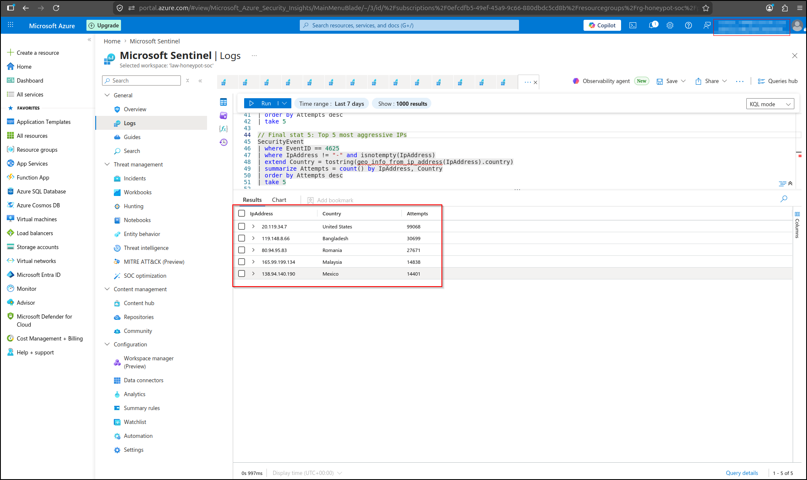

### 3.4 Username Targeting

A surprising finding: **48% of all attempts (144,605) targeted the username `\HONEYPOT`** — derived from the VM's hostname `honeypot-win10`. Attackers used hostname discovery (via RDP banner, NetBIOS, or certificate CN) to inform their credential guesses. The standard `\administrator` was second with 28,227 attempts.

| Username | Attempts |
|---|---|
| \HONEYPOT | 144,605 |
| \ADMINISTRATOR | 28,227 |
| \USER | 15,236 |
| \ADMIN | 6,026 |
| \BACKUP | 4,952 |

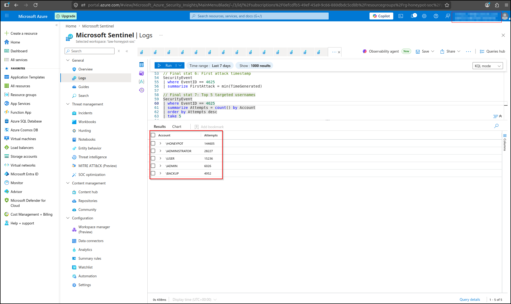

The username dictionary observed included non-English entries (`АДМИНИСТРАТОР` Cyrillic, `administrador` Spanish/Portuguese, `soporte` Spanish, `ricoh` vendor-specific), indicating broad multinational botnet activity.

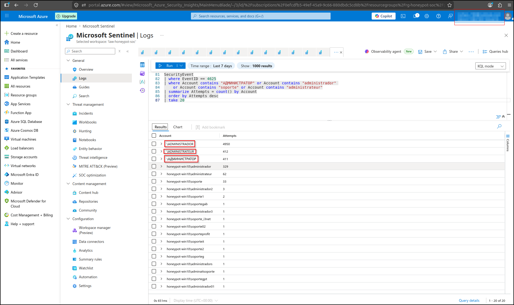

### 3.5 Detection Rule Results

All five custom analytics rules were deployed to Sentinel with appropriate MITRE ATT&CK mappings.

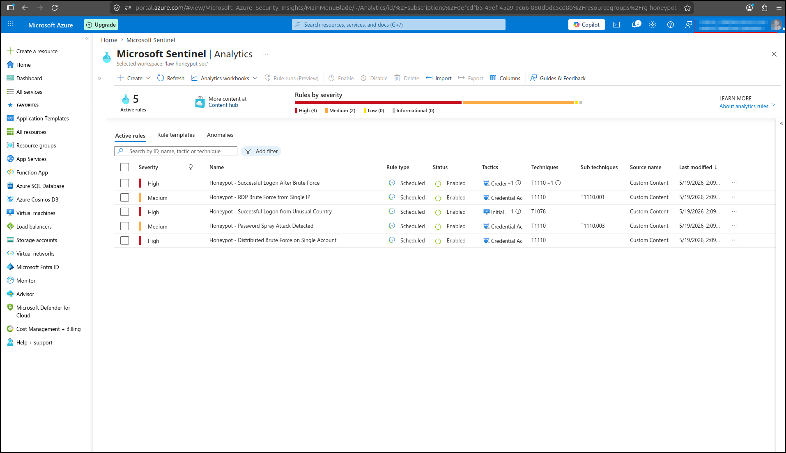

| Rule | Severity | Incidents | Notes |
|---|---|---|---|
| RDP Brute Force from Single IP | Medium | Multiple | Required tuning (LogonType filter) — see §4.1 |
| Successful Logon After Brute Force | High | 0 | Did not fire — no compromise occurred |
| Successful Logon from Unusual Country | High | 0 | Did not fire — no compromise occurred |
| Password Spray Detection | Medium | 27 | Strongest signal — pattern matched broadly |
| Distributed Brute Force on Single Account | High | Multiple | Caught coordinated botnet activity on \ADMINISTRATOR, \USER, \ADMIN |

#### Password Spray Rule Detail

The Password Spray rule fired most consistently, generating 27 incidents during the observation period:

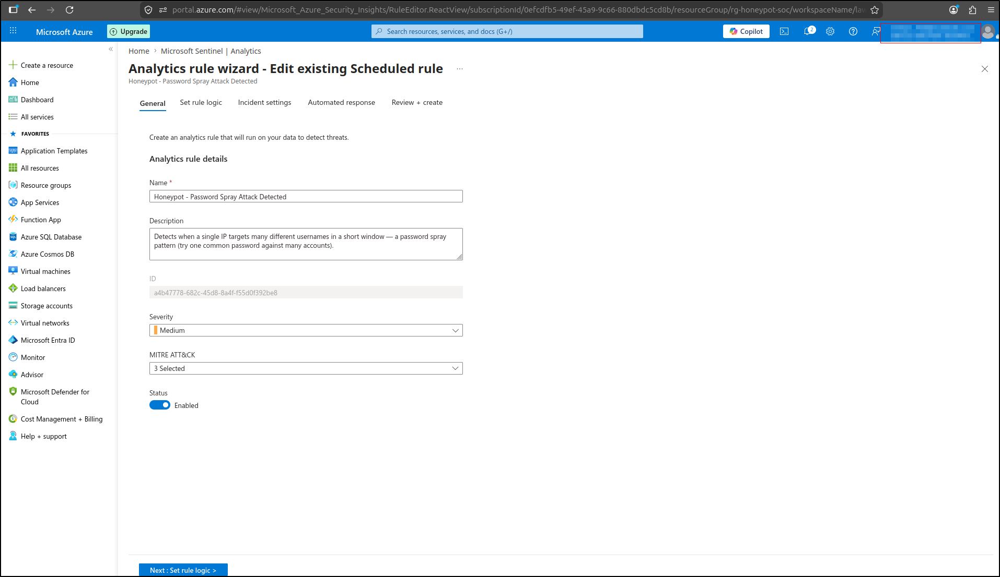

#### Sample Incident: Distributed Brute Force

The Distributed Brute Force rule successfully caught coordinated activity where multiple IPs targeted the same account within a 30-minute window:

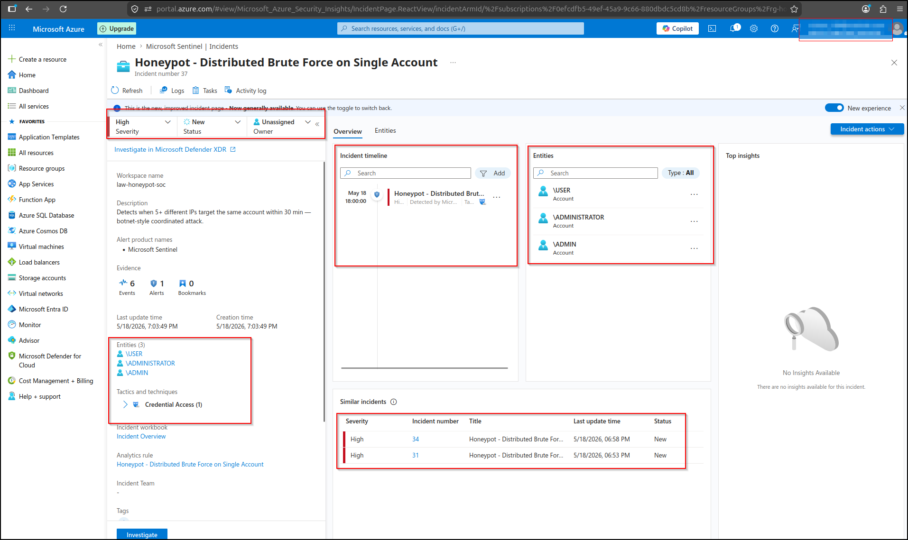

#### Entity Extraction in Action

Sentinel correctly extracted IP and Account entities from raw events, enabling correlation across incidents. This RDP Brute Force incident shows 10 entities (5 IPs + 5 account lists) automatically populated:

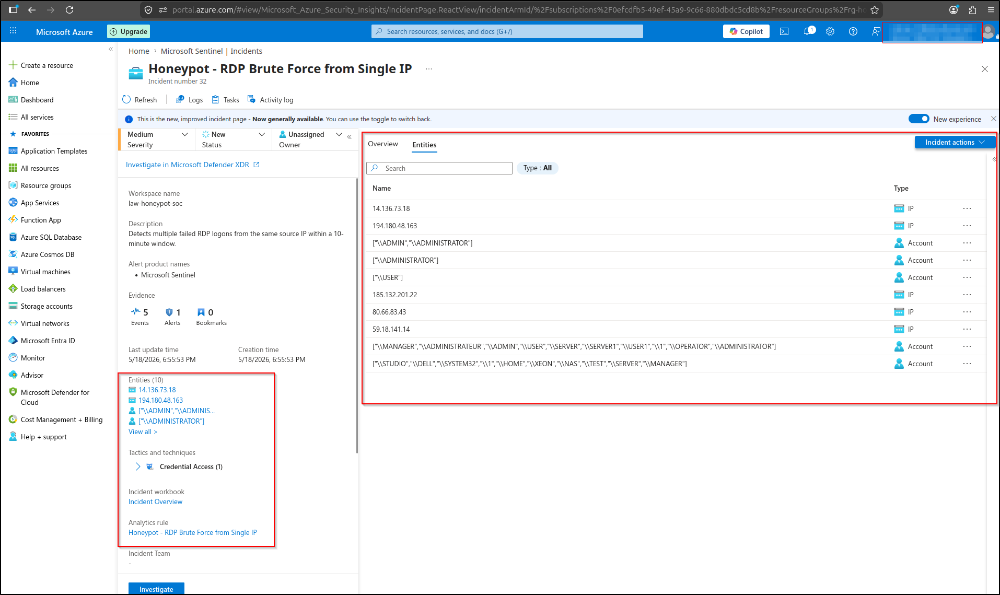

### 3.6 Compromise Status

A targeted KQL query for successful logons (Event ID 4624) from non-Australian IPs returned **zero results**. The honeypot was **not compromised** during the exposure period despite the high attack volume.

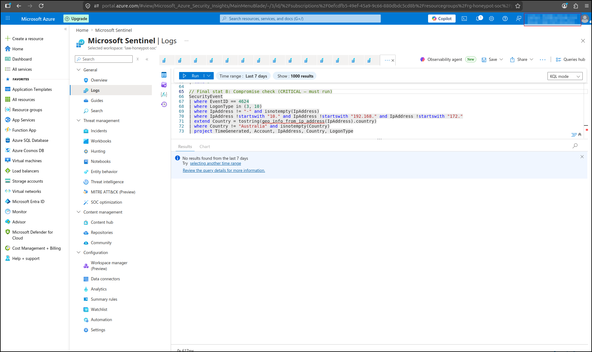

This validates that strong password discipline alone successfully defended against 297K+ attempts.

## 4. Lessons Learned

### 4.1 LogonType 3 vs 10 — Critical Tuning Insight

Initial rules filtered for `LogonType == 10` (RemoteInteractive). Analysis of all 297K failed logons revealed **100% logged as LogonType 3 (Network)** — none as LogonType 10. This is because RDP brute-force tools fail at Network Level Authentication (NLA) before Windows establishes a full RemoteInteractive session.

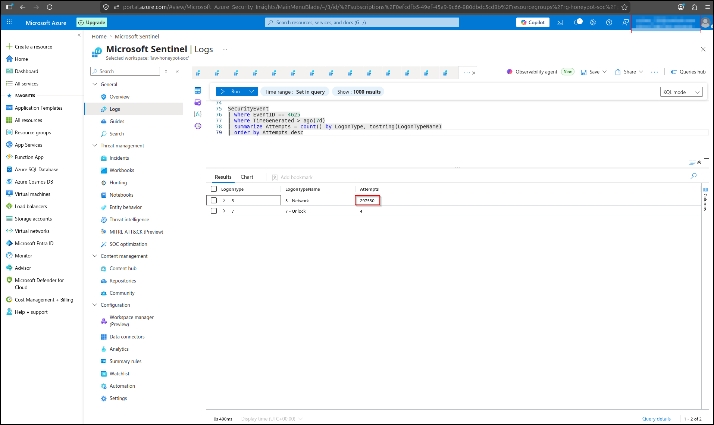

**Any production RDP detection rule must include LogonType 3.**

After updating Rule 1 to `LogonType in (3, 10)`, the rule began generating incidents within minutes. This single-line fix transformed an empty rule into a high-confidence detector.

### 4.2 Hostname Leakage as Reconnaissance Risk

48% of attack traffic targeted the VM hostname as a username. Production systems should use non-descriptive hostnames (e.g., `web-prd-04`, `app-srv-12`) rather than purpose-revealing names like `mail-server` or `domain-controller`. RDP banner suppression and disabling NetBIOS responses on internet-facing hosts are complementary controls.

### 4.3 Decision to Terminate Exposure Early

After ~72 hours of exposure with 297K attempts and rising compute risk, I made the deliberate decision to stop the experiment rather than continue collecting marginal data. This balanced:

- **Portfolio data quality** (already excellent at 100K+ attempts)
- **Compromise risk** (rising with each hour, especially with a non-extreme password)
- **Cost discipline** (avoiding cryptojacking-driven bill spikes if VM had been compromised)

This judgment call is itself a SOC analyst skill: knowing when "enough data" has been collected.

### 4.4 The Connector vs DCR Pitfall

Sentinel's `SecurityEvent` table is populated only when the DCR is created via the **Windows Security Events via AMA** connector page in Sentinel — *not* via the generic Monitor → Data Collection Rules path. Generic DCRs populate the `Event` table instead, which does not trigger Sentinel's built-in detections. This is poorly surfaced in Microsoft's documentation and consumed considerable troubleshooting time. Documented in detail in this repository so other learners avoid the same pitfall.

### 4.5 The Value of Empty Rules

Rules 2 (Successful Logon After Brute Force) and 3 (Logon from Unusual Country) never fired during the observation period. **This is the desired outcome** — a detection rule that doesn't fire because no compromise occurred is a valuable signal. Detection engineering measures both signal and silence.

## 5. Recommendations

### Mapped to ACSC Essential Eight

| Control | Evidence from this lab |
|---|---|
| **Multi-factor authentication** | Would have defeated 100% of observed password-based attacks. Highest-impact single control. |
| **Restrict administrative privileges** | `\administrator` was the #2 most targeted account. Renamed admin accounts and least-privilege models reduce attack surface. |
| **Patch operating systems** | Critical for post-compromise resilience (none observed here, but standard hygiene). |
| **Application control** | Would limit attacker tooling if breach occurred. |

### Detection Engineering Recommendations

1. **Always include LogonType 3 in RDP brute force detections** — the NLA-failure pattern is dominant.
2. **Tune thresholds against real telemetry** — initial thresholds (e.g., Rule 5's 5+ unique IPs) were close but not optimal; review thresholds quarterly.
3. **Don't expose RDP/3389 to the internet** — period. Use Azure Bastion, just-in-time VM access, or VPN-fronted RDP. The 297K attempt volume demonstrates this is non-negotiable in production.

## 6. Conclusion

This honeypot exercise demonstrated that:

- An exposed RDP port attracts massive attack volume within hours
- Modern attackers use diverse, multilingual, hostname-informed username dictionaries
- Strong password discipline alone successfully defended against 297K+ attempts
- Custom KQL detection rules in Sentinel can effectively identify common attack patterns
- Detection rule tuning is iterative — initial assumptions (LogonType 10) required revision against real telemetry

The lab also validated the importance of post-incident analysis: the most valuable insight (LogonType 3 dominance) emerged not from rule design but from interrogating *why* a rule did not fire. **Detection engineering measures both signal and silence.**

---

## Supporting Materials

- [Architecture documentation](../architecture/README.md)
- [KQL detection rules](../kql-queries/)
- [Incident response playbooks](../playbooks/)
- [Main project README](../README.md)
